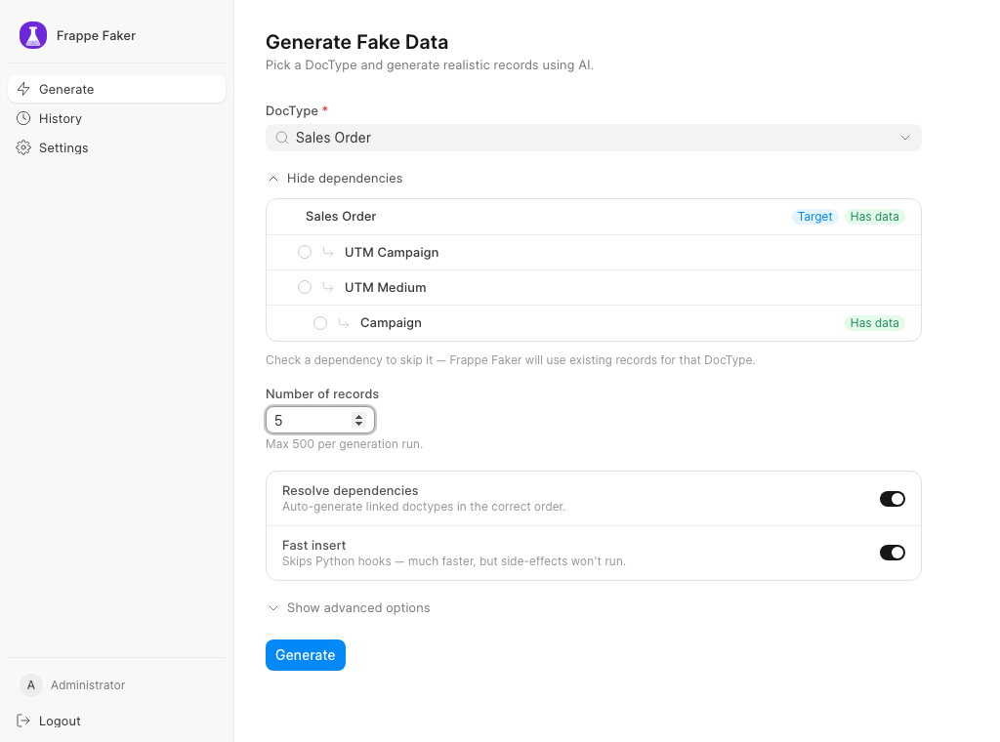
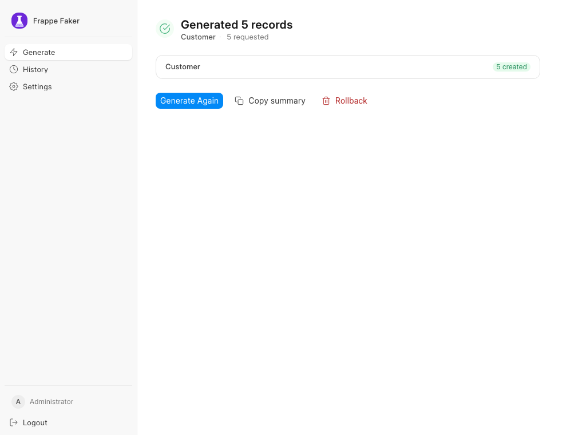
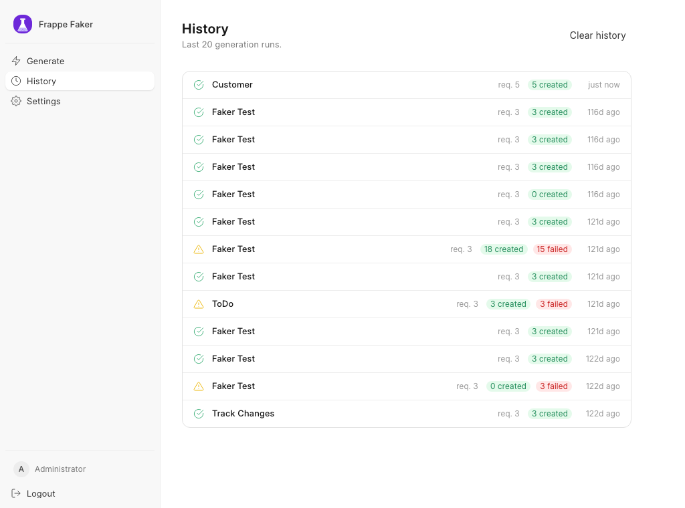

<p align="center">
  
</p>

<p align="center">
  
  
  
</p>

<p align="center">
  <samp>
    Point it at a DocType. It reads the schema, works out every DocType that one links to,<br>
    and generates records that actually validate and insert — in the order the foreign keys need.
  </samp>
</p>

<samp>

> A Sales Order needs a Customer, which needs a Customer Group. Generic faker libraries
> fill fields but ignore those links, so their rows fail on insert.

</samp>

<br>

# ✨ Features

<table>
  <tr>
    <td width="50%" valign="top"><samp>
      <b>Dependencies first, then the record</b>
      <br><br>
      Link fields are walked into a graph and topologically sorted, so nothing is inserted before the rows it points at. DocTypes that already have records are reused rather than regenerated, and 34 system DocTypes — User, Company, Currency, Fiscal Year and friends — are never fabricated.
    </samp></td>
    <td width="50%" valign="top"><samp>
      <b>The prompt is built from the schema</b>
      <br><br>
      Before any LLM call the DocType's meta is read into field types, Select options, required and unique flags, max lengths, child tables and the naming rule — plus up to 15 real existing names per Link field, so the model picks values that exist instead of inventing them.
    </samp></td>
  </tr>
  <tr>
    <td width="50%" valign="top"><samp>
      <b>Bring your own model</b>
      <br><br>
      OpenAI, Anthropic and Gemini are called through their native APIs; Ollama and any OpenAI-compatible endpoint go through the same chat-completions path. Every provider has a default model and endpoint, so a key is usually the only setting you need.
    </samp></td>
    <td width="50%" valign="top"><samp>
      <b>Every run is a batch you can undo</b>
      <br><br>
      Each inserted record is logged to a Faker Batch as it commits, so even a job that crashes halfway is still rollback-able. Rollback deletes in reverse insertion order, is idempotent, and reports per-record failures instead of aborting.
    </samp></td>
  </tr>
  <tr>
    <td width="50%" valign="top"><samp>
      <b>Two insertion paths</b>
      <br><br>
      The default path uses <code>db_insert</code>: raw inserts after name resolution, fast and immune to custom validation in the target DocType. Turn off <b>Fast insert</b> to go through <code>doc.insert()</code> instead, so controller hooks run and their side-effects land.
    </samp></td>
    <td width="50%" valign="top"><samp>
      <b>Built to survive big graphs</b>
      <br><br>
      The whole site's link graph is indexed into Redis on every <code>bench migrate</code>, so resolving a tree costs no <code>get_meta()</code> calls. LLM requests for independent DocTypes are fired in parallel, up to eight at a time, and UI runs go to the <code>long</code> queue with live progress.
    </samp></td>
  </tr>
</table>

<br>

# 📱 Preview

<table>
  <tr>
    <td width="33%"></td>
    <td width="33%"></td>
    <td width="33%"></td>
  </tr>
  <tr>
    <td width="33%" align="center" valign="top"><samp>
      <b>Generate</b>
      <br><br>
      Pick a DocType and see what it drags in. Tick any dependency to skip it and reuse the records already on the site.
    </samp></td>
    <td width="33%" align="center" valign="top"><samp>
      <b>Results</b>
      <br><br>
      A per-DocType breakdown of what was created, with the batch one button away from being deleted again.
    </samp></td>
    <td width="33%" align="center" valign="top"><samp>
      <b>History</b>
      <br><br>
      The last twenty runs, each with its counts and the full result payload behind it.
    </samp></td>
  </tr>
</table>

<br>

# ⚙️ Installation

<table>
<tr>
<td width="50%" valign="top">

<samp>

**📝 Prerequisites**

1. A **Frappe Bench** with a site on **v16+**
2. **Python 3.14**
3. An API key for **OpenAI**, **Anthropic** or **Gemini** — or a local **Ollama**

<br>

**🔮 Optional**

- A **System Manager** role on the site — everything here is gated on write access to Faker Settings

</samp>

</td>
<td width="50%" valign="top">

<samp>

**🪴 Usage**

1. Fetch the app into your bench:

       bench get-app https://github.com/wreckage0907/frappe_faker --branch develop

2. Install it on a site:

       bench --site mysite install-app frappe_faker

3. Open the app:

       http://mysite/faker

</samp>

</td>
</tr>
</table>

<br>

# 🚀 Getting started

<samp>

| | Step | What happens |
|---|---|---|
| **1** | **Settings › Open Faker Settings** | Pick an AI Provider, paste the API key, and optionally set a model name. Leave the model blank to take the provider's default. |
| **2** | **Generate › DocType** | Search and pick the DocType you want records for. |
| **3** | **Preview dependencies** | The resolved tree, annotated with `Target`, `Has data` and `Cyclic`. Tick anything you want skipped. |
| **4** | **Number of records** | Up to 500 per run. Dependencies are capped at 5 records each — enough to link against, not enough to bloat the site. |
| **5** | **Generate** | The run is queued on the `long` worker; the UI polls the job and shows progress. ⌘Enter also fires it. |
| **6** | **Rollback** | Deletes every record the run created and marks the batch rolled back. |

</samp>

<br>

<samp>

**The same three things from the CLI**

Inspect the tree without generating anything:

</samp>

```bash
bench --site mysite faker plan --doctype "Contact"
```

```
Dependency plan for: Contact

  Gender  [Has data — will skip]
  Google Contacts  [Has data — will skip]
  Salutation  [Has data — will skip]
    Tax Category  [Has data — will skip]
  Address  [Has data — will skip]
Contact  [Target] [Has data — will skip]
```

<samp>

Generate, with free-text steering for the model:

</samp>

```bash
bench --site mysite faker generate --doctype "Contact" --count 3 \
  --instructions "Procurement contacts at mid-size manufacturers"
```

```
Generating 3 record(s) for Contact...

Batch: epl2rl4v5o | Created: 3 | Failed: 0
  Contact: 3 created
```

<samp>

Undo the whole run with the batch id it printed:

</samp>

```bash
bench --site mysite faker cleanup --batch epl2rl4v5o
```

```
Rolling back batch epl2rl4v5o...
Deleted 3 record(s). Status: Rolled Back
```

<br>

# 🧠 How it works

<details>
<summary><b>🧬 The pipeline</b></summary>
<br>
<samp>

1. **Meta analysis** — `meta_analyzer` flattens the DocType into the parts a model can use:
   fields with their types and constraints, child tables with their own fields, the naming
   rule, and whether the document is submittable. Layout fields are dropped.
2. **Dependency resolution** — Link fields become edges; the graph is built to a depth of
   5 and sorted with Kahn's algorithm. Cycles are detected and reported rather than
   crashing the run, and the target DocType is exempt from the system blocklist so you can
   still generate Users if you ask for them directly.
3. **Prompt building** — the schema, the existing Link values and your free-text
   instructions are assembled into one prompt, under a system prompt that pins down date
   formats, Select options and internal consistency.
4. **Generation** — one call per DocType, fired in parallel for DocTypes that don't depend
   on each other. Malformed JSON is retried twice with the parse error fed back in; a valid
   array followed by stray prose is salvaged rather than retried.
5. **Insertion** — serial, in dependency order. Link values are validated in one query per
   DocType and broken references are cleared before insert, so one bad value costs a field
   rather than the record.
6. **Batch tracking** — created names are appended to the batch after each DocType commits.

</samp>
</details>

<details>
<summary><b>🗺️ Why the dependency index lives in Redis</b></summary>
<br>
<samp>

Resolving a tree the naive way means a `get_meta()` per DocType per level. Instead, an
`after_migrate` hook scans every non-child DocType once and stores the whole adjacency map
under a single Redis key — 651 of them on the bench this was written on — with no TTL,
because the only thing that changes it is another migrate.

Tree resolution then reads one key and walks it in memory. Depths come from a single BFS
pass, and the "does this DocType already have rows" check is one `count` per node.

</samp>
</details>

<details>
<summary><b>⚡ Fast insert vs. the standard path</b></summary>
<br>
<samp>

| | Fast insert (default) | Standard |
|---|---|---|
| Call | `doc.db_insert()` | `doc.insert()` |
| `validate` / `before_insert` / `on_update` | skipped | run |
| Controller side-effects (ledger entries, computed defaults) | none | as normal |
| Fails on custom validation rules | no | yes |
| Speed | raw SQL after name resolution | full document lifecycle |

Both paths wrap every record in a savepoint, so a failure rolls back that record and the
rest of the batch continues. Failures come back with the index, the error, and a trimmed
summary of the offending record.

</samp>
</details>

<details>
<summary><b>🤖 Providers</b></summary>
<br>
<samp>

| Provider | Default model | Default endpoint |
|---|---|---|
| OpenAI | `gpt-4o-mini` | `https://api.openai.com/v1/chat/completions` |
| Anthropic | `claude-sonnet-4-20250514` | `https://api.anthropic.com/v1/messages` |
| Gemini | `gemini-2.5-flash` | `generativelanguage.googleapis.com/v1beta` |
| Ollama | — | `http://localhost:11434/v1/chat/completions` |
| Custom | — | yours, OpenAI-compatible |

Any default can be overridden per field in Faker Settings. The Gemini endpoint accepts a
`{model}` placeholder if you need to point at a different API version.

</samp>
</details>

<details>
<summary><b>🧾 Data model</b></summary>
<br>
<samp>

| DocType | Role |
|---|---|
| **Faker Settings** | Single. Provider, key, endpoint, model, default count. |
| **Faker Batch** | One per run: target, status, timings, and the child table of records. |
| **Faker Batch Item** | One row per inserted record — DocType, name, rolled-back flag. |
| **Faker Run** | Per-user history entry with counts and the full result JSON. |

</samp>
</details>

<br>

# 🔌 Claude Code

<samp>

The repo ships a Claude Code skill at `.claude/skills/faker-data`, so an agent working in
your bench can seed the data a test needs and clean up after itself — plan the tree,
generate, hand back the batch id, roll it back when the test is done.

</samp>

<details>
<summary><b>🛠️ Setup</b></summary>
<br>
<samp>

The skill is picked up automatically when Claude Code runs inside the app directory. To use
it from the bench root instead, symlink it into place:

    ln -s apps/frappe_faker/.claude/skills/faker-data .claude/skills/faker-data

It shells out to the same `bench faker` commands documented above, so the only requirement
is a site with the app installed and a provider configured.

</samp>
</details>

<br>

<hr>

<p align="center">
  <samp>
    MIT &middot; built with <a href="https://frappeframework.com">Frappe</a> and <a href="https://ui.frappe.io">Frappe UI</a>
  </samp>
</p>
